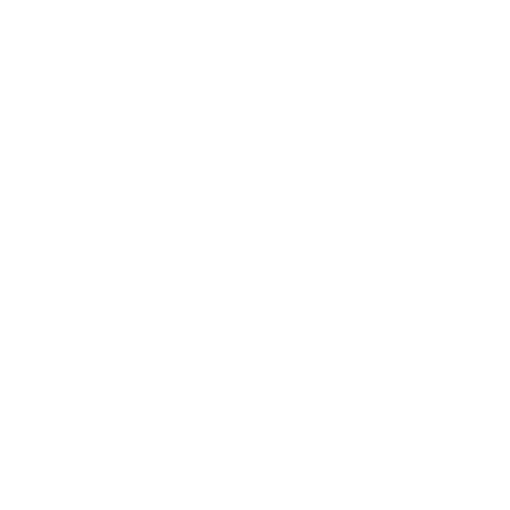

# Remote Caching (Nx Replay)

  

    Accelerate Team Development
  

  

    <!-- Left side: Benefits -->
    

      

        <h3 class="font-bold text-lg mb-4 flex items-center gap-2">
          <i class="i-mdi-rocket-launch text-[#143055]" />
          Key Benefits
        </h3>
        <ul class="space-y-3">
          <li class="flex items-center gap-2">
            <i class="i-mdi-check text-green-500" />
            Share task results across teams
          </li>
          <li class="flex items-center gap-2">
            <i class="i-mdi-check text-green-500" />
            Eliminate redundant operations
          </li>
          <li class="flex items-center gap-2">
            <i class="i-mdi-check text-green-500" />
            Reduce CI/CD pipeline times
          </li>
        </ul>
      

    

    <!-- Right side: Visual Diagram -->
    

      <!-- Central Cloud -->
      

        

          
        

      

      <!-- Connecting Lines -->
      <svg class="absolute inset-0 w-full h-full" xmlns="http://www.w3.org/2000/svg">
        <line x1="50%" y1="50%" x2="50%" y2="10%" stroke="#143055" stroke-width="2" />
        <line x1="50%" y1="50%" x2="90%" y2="50%" stroke="#143055" stroke-width="2" />
        <line x1="50%" y1="50%" x2="50%" y2="90%" stroke="#143055" stroke-width="2" />
        <line x1="50%" y1="50%" x2="10%" y2="50%" stroke="#143055" stroke-width="2" />
      </svg>
      <!-- Developer Machines -->
      

        

          <i class="i-mdi-laptop text-2xl"></i>
        

        

          <i class="i-mdi-laptop text-2xl"></i>
        

        

          <i class="i-mdi-laptop text-2xl"></i>
        

        

          <i class="i-mdi-laptop text-2xl"></i>
        

      

    

  

