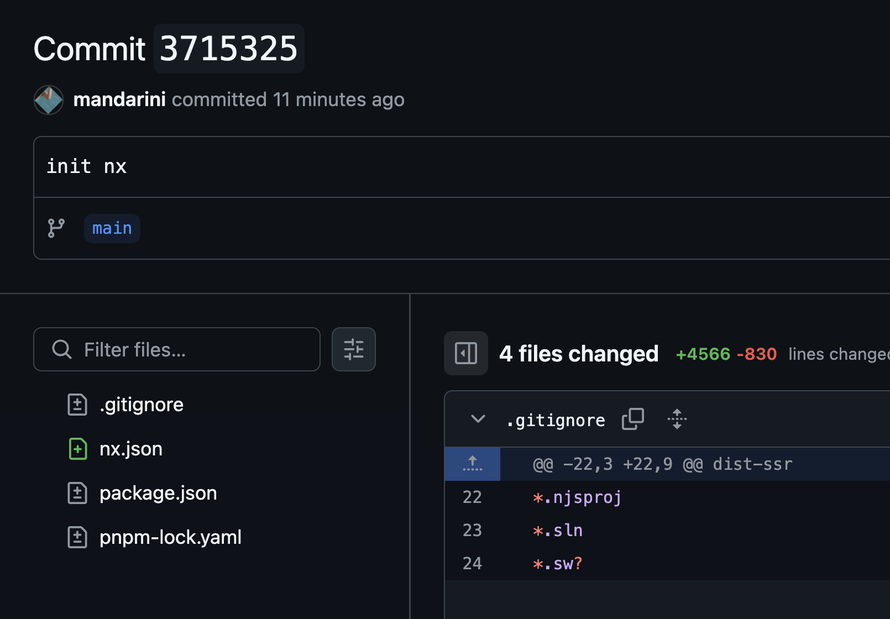

# Nx is Lightweight! 🪶

  

    <!-- Left side: Key points -->
    

      

        <i class="i-mdi-clock-fast text-4xl text-green-500 mb-4" />
        <h3 class="font-bold text-lg mb-2">Quick Setup</h3>
        

          $ npx nx init
        

        
Takes just seconds to run

      

      

        <i class="i-mdi-feather text-4xl text-blue-500 mb-4" />
        <h3 class="font-bold text-lg mb-2">Minimal Changes</h3>
        <ul class="text-sm text-gray-400 list-disc list-inside space-y-2">
          <li>Adds only nx.json</li>
          <li>Minor package.json updates</li>
          <li>No code changes needed</li>
        </ul>
      

    

    <!-- Right side: Git diff visualization -->
    

      

        
Git Diff omg

        

           
        

      

    

  

